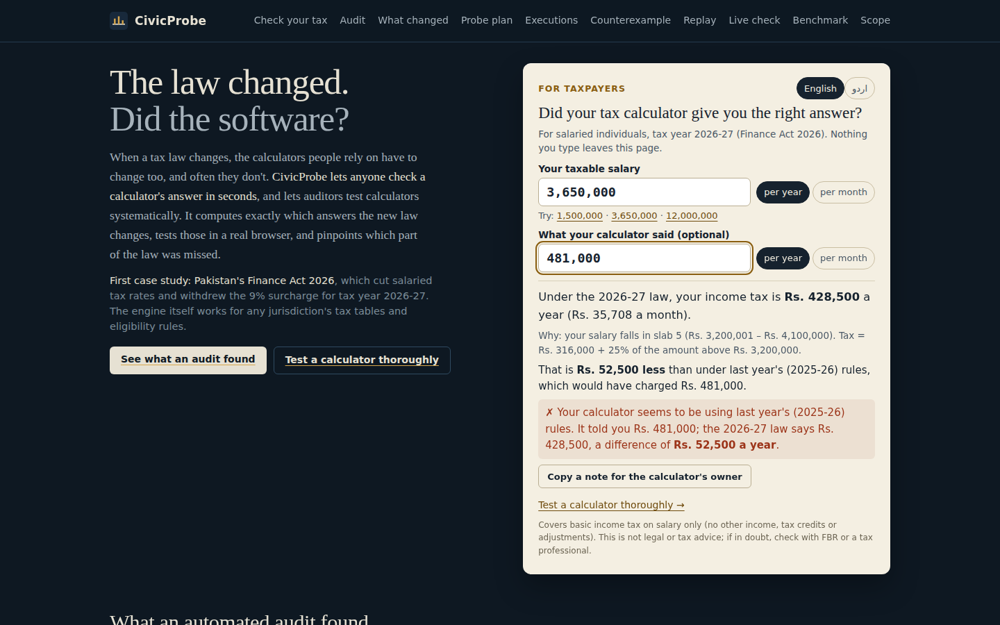
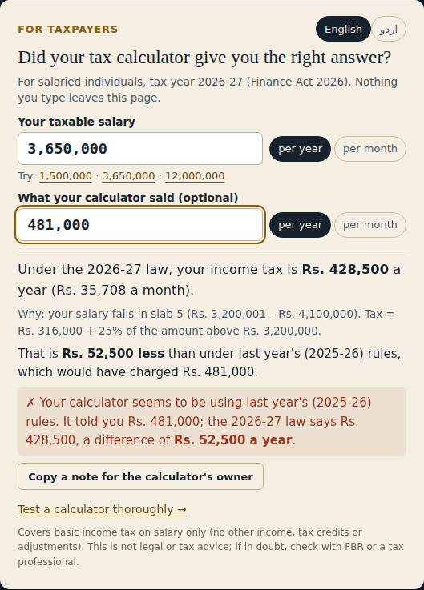
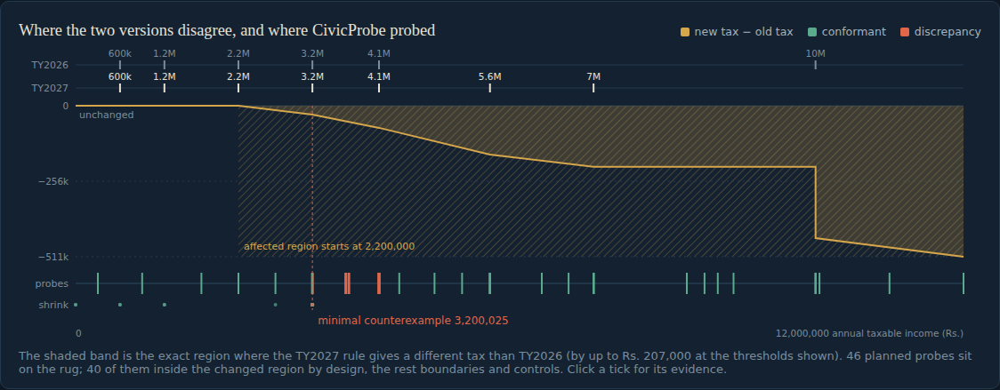
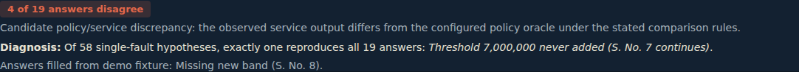
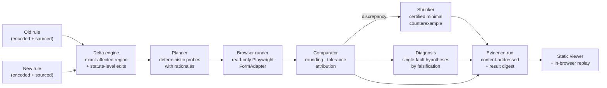
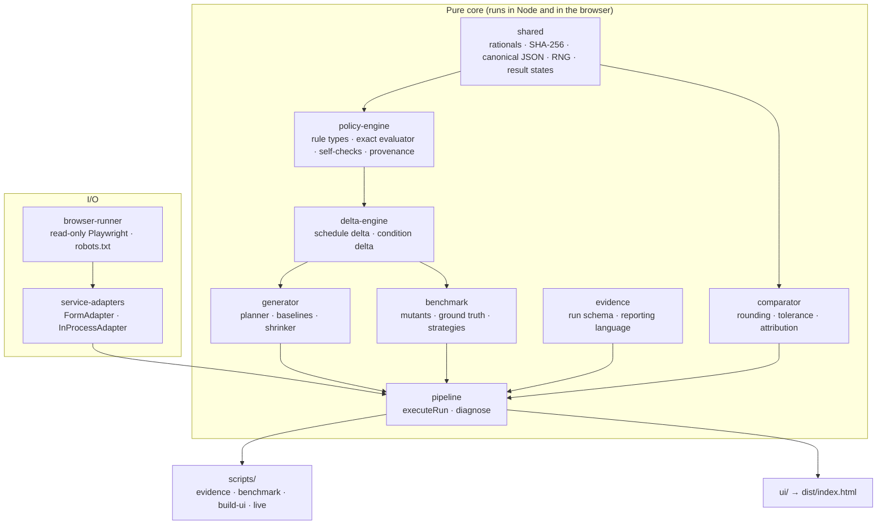

<div align="center">

# CivicProbe

*Built for LexHack 2026*

**The law changed. Did the software?**

Delta-directed conformance testing of citizen-facing software against a versioned, source-linked policy oracle.

[](https://github.com/Abdullah49645/civicprobe/actions/workflows/ci.yml)
[](LICENSE)

[](https://vercel.com/new/clone?repository-url=https%3A%2F%2Fgithub.com%2FAbdullah49645%2Fcivicprobe)


### [Try it live: civicprobe.vercel.app](https://civicprobe.vercel.app/)



</div>

---

## Contents

- [Why CivicProbe](#why-civicprobe)
- [For taxpayers](#for-taxpayers)
- [Results](#results)
- [How it works](#how-it-works)
- [Architecture](#architecture)
- [Getting started](#getting-started)
- [Usage](#usage)
- [Testing and reproducibility](#testing-and-reproducibility)
- [Deployment](#deployment)
- [Project structure](#project-structure)
- [Scope and responsible use](#scope-and-responsible-use)
- [Documentation](#documentation)
- [Contributing](#contributing) · [License](#license)

---

## Why CivicProbe

When a tax table, benefit rule or eligibility threshold is amended, every public calculator and
screener built on it has to change too. Partial updates are easy to ship and hard to notice. A new
rate might be copied in while an old bracket survives, or a withdrawn surcharge might still run in a
forgotten branch. Citizens then get confidently wrong answers.

CivicProbe takes the **old and new versions of a rule** and:

1. **computes exactly which inputs must now receive a different answer** (exact rational arithmetic, no sampling);
2. **plans probes where an unimplemented edit is most visible**, each with a written rationale;
3. **runs them against the real service** in a read-only browser and compares deterministically;
4. **shrinks** any disagreement to a minimal counterexample with a stated certificate; and
5. **diagnoses which edit** was not implemented, keeping only hypotheses that reproduce every observation.

Taxpayers can **check their own calculator's answer in seconds** ([details](#for-taxpayers)), and reviewers can **test any real calculator thoroughly** ([details](#test-any-calculator-thoroughly-in-the-live-site)).

Every result carries a complete evidence chain (source → rule → delta → probe → expected → observed →
comparison → interpretation). **No LLM decides anything.**

**Pakistan's Finance Act 2026 is the first case study:** the salaried income-tax table, **TY2026 → TY2027**,
including withdrawal of the 9% surcharge for salaried persons. The engine itself is jurisdiction-agnostic. It
works for any rule expressed as a progressive tax table or an eligibility rule; a second, invented
eligibility rule is included to demonstrate this.

## For taxpayers

The first thing on the site is a plain-language check anyone can use in seconds, in **English or Urdu**.
Enter your salary (per year or per month) and, optionally, what your calculator told you. You get:

- your correct 2026-27 income tax, with the slab and formula that produce it;
- how it compares with last year's (2025-26) rules, including the withdrawn surcharge;
- whether the calculator's answer is right, **uses last year's law**, or matches neither;
- a ready-to-send, polite note for the calculator's owner.

It uses the same exact evaluator and comparator as the audit engine, and nothing typed leaves the page.

<p align="center"></p>

## Results

### Recorded runs (seeded demo fixtures, real Chromium)

| Seeded fault | First detected | Minimal counterexample | Diagnosis (hypotheses surviving / tested) |
|---|---|---|---|
| S. No. 5 rate left at 30% | probe 2 of 46 | Rs. 3,200,025 | 1 / 58: C2, S. No. 5 rate stale |
| Withdrawn 9% surcharge still applied | probe 6 | Rs. 10,000,001 | 1 / 58: C11, surcharge withdrawal missed |
| New Rs. 7,000,000 threshold missing | probe 5 | Rs. 7,000,039 | 1 / 58: C9, threshold never added |
| Tax-year selector ignored | probe 1 | Rs. 2,200,037 | 1 / 58: entire table stale |
| Typo `<= 4101000` in a branch | probe 24 | Rs. 4,100,033 | 3 / 58: 4,100,000 threshold misplaced |
| Tax year 2026-27 not offered | discovery | none | `NOT_UPDATED`; zero probes sent |
| Correct implementation | none | none | 46 / 46 conformant |
| Fee waiver: age check left at 65 (2-field rule) | probe 1 | age 60, income 0 | 1 / 3: C1, age threshold stale |

For the first row, the minimal case differs by Rs. 2 after rounding. The same fault reaches
**Rs. 45,000.25** at Rs. 4,099,999. The minimal case is simply where the fault first becomes visible.

### Benchmark: mutation analysis ([full report](docs/benchmark.md))

60 faulty implementations are generated mechanically from the two versions of the table. Ground truth
is computed exactly, and 3 mutants that are provably undetectable under the comparison rule are
excluded. Random testing is averaged over 300 seeds.

| Share of 47 in-scope faults detected within | 10 probes | 25 probes | 50 probes |
|---|---:|---:|---:|
| **CivicProbe (delta-directed)** | 34.0% | 74.5% | **100%** |
| Uniform random | 27.5% | 34.4% | 36.7% |
| Boundary-value analysis | 4.3% | 34.0% | 34.0% |
| Evenly spaced grid | 34.0% | 34.0% | 34.0% |

- The exact minimal counterexample is recovered **46/47** times with CivicProbe's shrinker, vs **25/47** with plain bisection.
- Losses are reported too: random is faster on a display-rounding fault, and typos at thresholds the
  amendment did not touch are out of scope (CivicProbe detects 0%).

<p align="center"></p>

### Test any calculator thoroughly (in the live site)

<p align="center"></p>


The deployed viewer includes **Test a calculator thoroughly**. It lists the 19 incomes CivicProbe's
plan considers most revealing: divergence witnesses, thresholds, hidden-threshold checks and controls.
Enter them into *any* salary-tax calculator in another tab (annual or monthly input and output are both
supported) and type what it shows. The same comparator and diagnosis engine judges the answers in your
browser and names the single edit that explains them, if one does. You act as the browser: no server,
no automated traffic to anyone's site. A one-click "fill with a demo fixture's answers" option shows the
flow without leaving the page.

## How it works



| Stage | What it guarantees |
|---|---|
| **Delta** | Splits the input domain into cells: every breakpoint of either version as a singleton, and open intervals between them. On each cell NEW − OLD is affine, so "differs here" is proved exactly. Honors statutory `(over, upTo]` semantics. Emits statute-level edits (C1–C11 for the PK table). |
| **Plan** | Divergence witnesses (where \|NEW − OLD\| peaks per cell), thresholds T/T+1/T−1, **observability probes** at k = ⌊(τ+1)/Δslope⌋+1 (where a misplaced threshold must exceed tolerance τ after rounding), interior points, controls in unchanged rows, and seeded draws. Same inputs → byte-identical plan. |
| **Execute** | One config-driven `FormAdapter` for fixtures *and* live sites: fill, submit, read visible text, guard units. Off-origin navigation and mutating requests are blocked; requests are rate-capped; robots.txt is honored. |
| **Compare** | Exact rounding (half-up / floor / ceil / none) with an inclusive tolerance. Each result is one of six states: `CONFORMANT`, `DISCREPANCY`, `UNDETERMINED`, `ASSUMPTION_MISMATCH`, `NOT_UPDATED`, `EXECUTION_FAILURE`. Failures are never counted as discrepancies. Attribution: `MATCHES_NEW / OLD / BOTH / NEITHER`. |
| **Shrink** | Rounding makes failure non-monotone, so bisection alone is unsound. Structural anchors → bisection → exhaustive window, emitting a certificate (`exhaustive-above-fence`, `one-minimal`, `at-domain-minimum`, `coordinate-one-minimal`). |
| **Diagnose** | Enumerates hypotheses from the delta (each edit stale alone, missing thresholds, legacy branch, misplaced thresholds, whole table stale). A hypothesis is kept only if it reproduces **every** observation. |
| **Evidence** | `runId = hash(policies, plan, adapter, comparison, target)`; a `resultDigest` covers every execution. The viewer bundles the engine and recomputes the digest in the browser. |

## Architecture

The code is a TypeScript monorepo of small, dependency-free packages. Only `browser-runner` and
`service-adapters` depend on Playwright. Everything else is pure and also runs in the browser.



| Package | Responsibility |
|---|---|
| [`shared`](packages/shared/src) | BigInt `Rational`, pure-TS SHA-256, canonical JSON, `mulberry32` RNG, result-state and comparison types |
| [`policy-engine`](packages/policy-engine/src) | `ProgressiveSchedule` and `EligibilityRule` types, exact evaluation, continuity self-check, rule hashing, provenance |
| [`delta-engine`](packages/delta-engine/src) | Exact cell decomposition for schedules; box decomposition for eligibility conditions; edit extraction |
| [`generator`](packages/generator/src) | Delta-directed planner, random/grid/boundary baselines, 1-D and coordinate shrinkers with certificates |
| [`comparator`](packages/comparator/src) | Numeric and categorical comparison with explicit, required configuration |
| [`browser-runner`](packages/browser-runner/src) | Playwright wrapper enforcing the allow-list, blocking mutating requests, rate caps, robots.txt parsing |
| [`service-adapters`](packages/service-adapters/src) | `FormAdapter` (config-driven, fixture and live) and `InProcessAdapter` (direct calls, used for replay) |
| [`pipeline`](packages/pipeline/src) | `executeRun`: validate → delta → plan → discover → execute → compare → shrink → diagnose → evidence |
| [`evidence`](packages/evidence/src) | `civicprobe.run/2` schema, identity and digests, cautious reporting language |
| [`benchmark`](packages/benchmark/src) | Mutant generation from the delta, computed ground truth, strategy comparison |

## Getting started

### Prerequisites

- **Node.js 22** (see `.nvmrc`)
- About 300 MB of disk for Playwright's Chromium

### Install

```bash
git clone https://github.com/Abdullah49645/civicprobe.git
cd civicprobe
npm ci
npx playwright install chromium      # add --with-deps on a fresh Linux machine
```

### Verify everything

```bash
npm run verify     # typecheck + unit/property tests + benchmark gates + build
npm run test:e2e   # real-Chromium end-to-end tests against local fixtures
```

### Open the viewer

```bash
npm run build      # → dist/index.html (single self-contained file)
open dist/index.html            # macOS  (Linux: xdg-open, Windows: start)
```

The viewer works offline from `file://`. Click **Re-run in this browser** to recompute a run's delta, plan and result
digest with the bundled engine.

## Usage

| Command | What it does |
|---|---|
| `npm test` | Unit + property + pipeline tests (56), then real-browser e2e tests (21) |
| `npm run test:unit` | Pure tests only; no browser needed |
| `npm run test:e2e` | Chromium drives each local fixture (browser ≡ in-process digests) and the built viewer (taxpayer check, live check, replay) |
| `npm run typecheck` | `tsc --noEmit`, strict mode |
| `npm run evidence` | Records all 9 scenarios in Chromium → `evidence/runs/*.json`; aborts if an in-process replay digest differs |
| `npm run evidence -- --only tax-stale-rate` | Record a single scenario |
| `npm run benchmark` | Full mutation-analysis benchmark → `docs/benchmark.json` and `docs/benchmark.md` |
| `npm run benchmark:check` | Fast benchmark with sanity gates (used in CI) |
| `npm run build` | Bundles the engine + evidence into `dist/index.html` |
| `npm run live -- --target <id>` | **Manual only.** Live target, discover-only by default; see [below](#scope-and-responsible-use) |

### Adding a live target

Targets are configuration, not code: see [`fixtures/live-targets.ts`](fixtures/live-targets.ts).

```ts
{
  id: "example",
  priorityProbes: [10_000_001, 12_000_000],
  config: {
    target: { id: "live:example", label: "Example calculator", nature: "LIVE_TARGET", url: "https://example.org/calc", seededFault: null },
    allowedOrigins: ["https://example.org"],
    runner: LIVE_RUNNER_CONFIG,                      // 1.5 s between requests, 120 max
    versionSelect: { selector: "#year", optionPattern: "2026-27" },
    fields: [{ name: "income", selector: "#salary", transform: "annual-to-monthly" }],
    submit: "button[type=submit]",
    result: "#result",
    parse: { kind: "number", pattern: "annual tax[^0-9]*([0-9,]+)", unitGuard: "annual" },
  },
}
```

```bash
npm run live -- --target example             # discover only: checks robots.txt, finds the form, probes nothing
npm run live -- --target example --priority  # a handful of priority probes
npm run live -- --target example --probe     # full delta-directed plan + shrinking
```

Live output goes to `evidence/live/` (git-ignored) and is marked `PRIVATE_FINDING`.

## Testing and reproducibility

| Layer | Examples |
|---|---|
| **Property tests** | 200 random schedule pairs: `inAffected(x) ⇔ OLD(x) ≠ NEW(x)` at every breakpoint, ±1, random integers and non-integers; random nested and/or/not eligibility rules checked against brute force; SHA-256 vs `node:crypto` |
| **Adversarial delta cases** | Moved and removed surcharges, crossing formulas, identical versions, bracket splits with identical formulas, bounded rate changes |
| **Oracle cross-validation** | Both versions reproduce all 9 worked values in KPMG's *Brief of Finance Act, 2026*; the old table reproduces 5 PakFiler examples; each committed source excerpt's hash and parsed table must equal the encoded rows |
| **Shrinker** | Non-monotone rounding predicate, disconnected narrow bands, interacting 2-D fields; certificates audited against the trace |
| **Pipeline** | Every result state, including failures that must *never* become discrepancies; determinism; diagnosis for every seeded fault |
| **Viewer** | The built site in Chromium: taxpayer check against KPMG values (annual, monthly, Urdu), old-law detection, live-check diagnosis, in-page replay digest, zero console errors, no overflow on a 360 px phone |
| **End-to-end** | Real Chromium for all 9 scenarios; identical run id and digest across two independent runs on different ports; annual-vs-monthly parsing; unit guard; read-only guard; rate cap |

**Determinism.** Plans are seeded and content-addressed, so the same spec always yields the same `runId`,
`planId` and `resultDigest`. `npm run build` is byte-reproducible, and CI fails if the committed
`dist/` drifts.

## Deployment

The viewer is a **fully static site**: one self-contained `dist/index.html` with no backend, no API
calls and no external assets. Everything runs in the visitor's browser, including **Replay**, which
re-executes the bundled engine.

### Vercel (recommended)

Live at **https://civicprobe.vercel.app/**

1. Push this repository to GitHub.
2. In Vercel: **Add New → Project → Import** `Abdullah49645/civicprobe`.
3. Leave the defaults. [`vercel.json`](vercel.json) already sets:

   | Setting | Value |
   |---|---|
   | Framework preset | Other (none) |
   | Install command | `npm ci` |
   | Build command | `npm run build` |
   | Output directory | `dist` |
   | Node.js version | 22.x (from `package.json` `engines`) |

4. Deploy. Every push to `main` redeploys automatically, and pull requests get preview URLs.

The build needs no browser and no network beyond `npm ci`. It bundles the committed `evidence/` and
`docs/benchmark.json` into the page. `vercel.json` also sets a strict Content-Security-Policy (no
network connections from the page) and standard security headers.

To refresh what the site shows, re-record locally and push:

```bash
npm run evidence && npm run benchmark && npm run build
git add evidence docs dist && git commit -m "Refresh evidence" && git push
```

### Continuous integration

[`.github/workflows/ci.yml`](.github/workflows/ci.yml) runs on every push and pull request. It runs
the typecheck, unit tests, real-Chromium e2e tests and benchmark gates, and checks that the committed
`dist/` is reproducible. **CI never contacts a live site.**

## Project structure

```
civicprobe/
├── packages/            # engine (see Architecture)
├── fixtures/
│   ├── policies/        # PK salaried tax TY2026/TY2027; invented fee-waiver rule
│   ├── sources/         # verbatim statutory excerpts (hashes recorded in the policies)
│   ├── services/        # independent fixture calculators with seeded faults + HTTP servers
│   ├── scenarios.ts     # the 9 demo scenarios, as data
│   └── live-targets.ts  # candidate live targets (selectors unverified)
├── tests/e2e/           # real-browser tests
├── scripts/             # evidence · benchmark · build-ui · live
├── ui/                  # viewer source (template.html + app.ts)
├── evidence/            # recorded runs + manifest (committed)
├── dist/                # built viewer (committed, reproducible)
└── docs/                # benchmark report, responsible testing, reporting language, images
```

## Scope and responsible use

- **The oracle is real; the services under test are demo fixtures.** Fixtures are labelled `DEMO_FIXTURE`
  everywhere and are independent implementations. They never reuse the oracle's code.
- **Oracle status: CORROBORATED, not LOCKED.** The encodings are cross-checked against published worked
  values, but the enacted Act's PDF has not yet been hashed. See [Target dossier](docs/TARGET_DOSSIER.md).
- **No live service has been tested yet.** The live runner is built and safe by construction, but no
  real-world discrepancy is claimed.
- CivicProbe reports **candidate discrepancies against a stated encoding**. It never asserts illegality. See
  [docs/reporting-language.md](docs/reporting-language.md).
- The live runner is read-only, rate-limited and robots-aware, and never bypasses authentication or CAPTCHAs.
  See [docs/responsible-testing.md](docs/responsible-testing.md).

## Documentation

| Document | Contents |
|---|---|
| [Design decisions](docs/DECISIONS.md) | Key design decisions and why |
| [Limitations](docs/LIMITATIONS.md) | What CivicProbe does not do |
| [Target dossier](docs/TARGET_DOSSIER.md) | Oracle sources, verification status, live-target leads and procedure |
| [docs/benchmark.md](docs/benchmark.md) | Generated benchmark report (method, results, losses) |
| [FAQ](docs/FAQ.md) | Common questions |
| [CHANGELOG.md](CHANGELOG.md) | Release notes |
| [CONTRIBUTING.md](CONTRIBUTING.md) · [SECURITY.md](SECURITY.md) | How to contribute; disclosure policy |

## Contributing

Contributions are welcome. See [CONTRIBUTING.md](CONTRIBUTING.md). In short: run `npm run verify && npm run test:e2e`,
never add a test that contacts a live site, and regenerate evidence (`npm run evidence && npm run build`) after
engine changes.

## License

[MIT](LICENSE). Third-party notices: [THIRD_PARTY_NOTICES.md](THIRD_PARTY_NOTICES.md).

Built by [Abdullah](https://github.com/Abdullah49645) for [LexHack 2026](https://lexhack-2026.devpost.com/).
